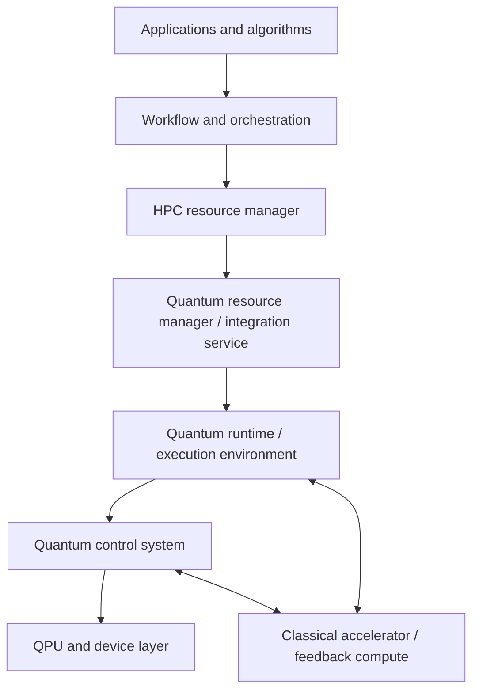

# Meeting 1 — Scope and Charter

**Duration:** 60 minutes maximum  
**Meeting type:** Decision gate  
**Milestone:** Landscape & Requirements v0.1  
**Target:** SC26-ready release by November 13, 2026

## Purpose

Agree on the problem space that the OpenQSE Quantum Control Working Group will characterize in Milestone 1—independent of any current partner, vendor, or reference implementation.

The existing OpenQSE SC26 architecture will be used as a validation case after the broader scope is defined. It does not define the scope.

## Decisions required today

By the end of the meeting, the group should decide:

1. What is in scope and explicitly out of scope for Milestone 1?
2. Which use-case classes will drive the analysis?
3. Is the straw-man functional architecture a sufficient starting point?
4. Which interface boundaries are primary, adjacent, or context-only for this working group?
5. Who owns the first use-case, architecture, and landscape contributions?

Items that cannot be resolved today will be recorded as open questions with an owner and deadline. The group is approving a starting baseline, not a final standard.

## Required pre-read

Please review this page before the meeting and comment on:

- one missing use case;
- one boundary that should move in or out of scope; and
- one interface where your organization has relevant experience or evidence.

## Agenda

| Time | Topic | Method | Output |
|---:|---|---|---|
| 0:00–0:05 | Opening and desired decisions | Chair framing | Shared objective and decision rules |
| 0:05–0:15 | Milestone 1 scope | Review scope straw man; discuss only proposed changes | Provisional in/out-of-scope boundary |
| 0:15–0:28 | Use-case prioritization | Validate, merge, and rank tentative use cases | Five to seven use-case classes |
| 0:28–0:40 | Functional architecture | Walk through logical roles and missing functions | Accepted architecture baseline or named revisions |
| 0:40–0:52 | Interface taxonomy | Classify interfaces as primary, adjacent, or context | Initial interface register and work priorities |
| 0:52–0:58 | SC26 relationship and v0.1 contents | Confirm reference-architecture role | SC26 mapping principle and v0.1 package |
| 0:58–1:00 | Owners and deadlines | Read back decisions and assignments | Named owners and due dates |

## Facilitation rule

Do not wordsmith during the meeting. Capture proposed wording changes as issues unless they change scope or technical meaning. Use the meeting for decisions that cannot be resolved asynchronously.

---

## 1. Proposed scope

### Scope statement

> Milestone 1 will characterize the functional roles, interfaces, information flows, timing regimes, and interoperability requirements that connect HPC resources and quantum execution/control systems for scalable hybrid HPC–QC operation. It will survey existing approaches, identify gaps, and prioritize candidate boundaries for later OpenQSE specification and validation work.

### In scope

- Functional boundaries from HPC scheduling and quantum resource management through quantum runtime, control, and feedback.
- Batch, workflow, co-scheduled, near-time, and deterministic real-time integration regimes.
- Resource and capability discovery, allocation, configuration, execution, status, cancellation, and release.
- Control-plane and data-plane interactions, including measurement streams, parameter updates, telemetry, and error reporting.
- Requirements for latency, jitter, bandwidth, synchronization, determinism, availability, security, isolation, and scale.
- CPU/GPU/FPGA/other classical accelerator interaction with the quantum runtime or control system.
- Existing standards, protocols, APIs, open-source systems, and vendor approaches relevant to these boundaries.
- Mapping of one or more implementations—including the SC26 architecture—onto the vendor-independent functional model.

### Out of scope for Milestone 1

- Selecting or endorsing a preferred vendor, product, scheduler, workflow engine, or transport.
- Treating the present SC26 partner stack as the complete OpenQSE architecture.
- Producing a normative interface specification; that belongs to later milestones.
- Standardizing quantum programming languages, circuit semantics, or algorithm APIs except where boundary requirements depend on them.
- Standardizing internal vendor compiler, pulse-scheduling, firmware, or device-control implementation details.
- Defining device-specific analog/RF electrical interfaces or qubit-physics requirements.
- Publishing comparative vendor rankings or uncontextualized performance claims.
- Requiring precise numerical values where evidence is not yet available.

### Scope questions for the group

1. Does the working group own the full path from the HPC resource manager to the QPU, or primarily the runtime/control and feedback boundaries?
2. Should batch and workflow-level use cases remain in scope as context, even if another OpenQSE group owns their interfaces?
3. Is the control-system-to-QPU boundary part of this landscape, or should it be treated as an external/device-specific boundary?
4. Should multi-QPU and distributed quantum systems be a first-class use case now, or a scalability dimension applied to all use cases?
5. At which boundaries do security, tenancy, provenance, and observability need explicit treatment in v0.1?
6. What terminology needs alignment with other OpenQSE groups before the interface IDs are frozen?

---

## 2. Tentative use cases

The use cases are requirement drivers, not commitments that OpenQSE will standardize every interface they touch.

| ID | Use-case class | Short scenario | Timing regime | Proposed relevance |
|---|---|---|---|---|
| UC-01 | Remote or batch quantum execution | An HPC job submits work to a quantum resource and later retrieves status and results | Loose / asynchronous | Context |
| UC-02 | Workflow-level hybrid execution | A workflow coordinates dependent CPU, GPU, and QPU tasks with data exchange | Loose to near-time | Adjacent |
| UC-03 | Co-scheduled HPC–QPU execution | CPU/GPU/QPU resources and network paths are reserved together for one hybrid job | Scheduling-sensitive | Primary |
| UC-04 | Iterative calibration and adaptive execution | Measurement results drive parameter updates or subsequent executions within a session | Near-time | Primary |
| UC-05 | Deterministic classical-to-control interaction | Classical compute exchanges data or commands with control hardware under bounded timing | Real-time | Primary |
| UC-06 | QEC decoding and fast feedback | Measurements stream to a decoder and corrections or frame updates return before a deadline | Hard real-time / streaming | Primary |
| UC-07 | Multi-QPU or distributed execution | A workflow coordinates multiple QPUs or control domains with topology and synchronization constraints | Mixed | Discussion needed |

### Prioritization questions

- Does each use case impose a meaningfully different set of interface requirements?
- Are calibration and adaptive algorithms one class or two?
- Is multi-QPU execution a separate use case or a scale/topology attribute?
- Which use cases must be represented in the SC26 v0.1 document even if they are not demonstrated?
- Are any important scenarios missing, such as sensing, networking, digital twins, or real-time experiment steering?

### Proposed acceptance test

Retain a use case if it either:

1. introduces a distinct timing, data movement, scheduling, synchronization, security, or scale requirement; or
2. exposes an interoperability boundary that would otherwise be missed.

---

## 3. Straw-man functional architecture

This model describes logical roles. A product or project may combine several roles, and a role may be distributed across several systems.

### Cross-cutting concerns

The following apply across multiple layers rather than forming a single vertical layer:

- identity, authorization, tenancy, and isolation;
- capability discovery and topology description;
- time distribution and synchronization;
- observability, provenance, logging, and error reporting;
- lifecycle, health, and configuration management; and
- portability, versioning, and compatibility negotiation.

### Architecture questions

1. Is a quantum resource manager distinct from the quantum runtime, or is that separation implementation-dependent?
2. Should classical feedback compute be shown as one logical role or as CPU/GPU/FPGA variants?
3. Does a separate data movement or event-streaming service need to be explicit?
4. Where does session management live?
5. Which control functions must remain local to the control system, and which may be exposed upward?
6. Are time synchronization and observability cross-cutting concerns or explicit services?

---

## 4. Initial interface register

The IDs are provisional until Meeting 2. “Primary” means the Quantum Control WG should directly characterize the interface. “Adjacent” means coordination with another OpenQSE activity may be needed. “Context” means the interface is needed to understand end-to-end use cases but is unlikely to be specified by this group.

| ID | Boundary | Example information exchanged | Initial classification | Key questions |
|---|---|---|---|---|
| IF-A | Application ↔ Workflow/orchestration | Workflow graph, tasks, dependencies, result references | Context | What quantum-resource semantics must applications express? |
| IF-B | Workflow/orchestration ↔ HPC resource manager | Job request, dependencies, placement, status | Adjacent | How are hybrid resources requested and dependencies represented? |
| IF-C | HPC resource manager ↔ Quantum resource manager | Discover, allocate, reserve, start, stop, status, release | Primary/adjacent | How is a QPU represented, co-allocated, isolated, and monitored? |
| IF-D | Quantum resource manager ↔ Quantum runtime | Capabilities, sessions, executable submission, lifecycle, errors | Primary | What vendor-neutral lifecycle and capability model is required? |
| IF-E | Quantum runtime ↔ Control system | Programs, configurations, parameters, triggers, results, telemetry | Primary | What must be portable, streamed, versioned, or deterministic? |
| IF-F | Classical accelerator ↔ Quantum runtime | Batched data, kernels, parameters, measurement products | Primary | Which near-time paths and data representations are required? |
| IF-G | Classical accelerator ↔ Control system | Measurement stream, decoder input/output, corrections, triggers | Primary | What latency, jitter, transport, synchronization, and failure semantics apply? |
| IF-H | Control system ↔ QPU/device layer | Analog/digital I/O, triggers, clocking, device responses | Landscape only / discuss | Which aspects are interoperable versus device-specific? |
| IF-I | Telemetry/observability across layers | Health, metrics, traces, provenance, alarms | Cross-cutting | What minimum observability and error model is needed end to end? |
| IF-J | Time and synchronization across layers | Clock source, timestamps, phase/time alignment, deadlines | Cross-cutting | Which components share time, and with what accuracy and holdover? |

### Interface characterization fields

Each retained interface will later be described using:

- purpose and endpoints;
- operations and state transitions;
- control-plane and data-plane flows;
- data model and versioning;
- latency, jitter, bandwidth, determinism, and synchronization;
- resource scale, topology, and concurrency;
- security, isolation, failure, and recovery semantics;
- existing implementations or standards; and
- evidence, gaps, and open questions.

---

## 5. Relationship to the SC26 reference architecture

Proposed decision:

> The OpenQSE SC26 reference architecture is one concrete implementation and validation vehicle. It will be mapped onto the logical roles and interfaces defined by this working group, but it will neither constrain the landscape nor define the standard.

For v0.1, each interface should be labeled as:

- **Demonstrated at SC26**;
- **Partially exercised at SC26**;
- **Architecturally represented but not exercised**; or
- **Outside the SC26 implementation**.

The last category is a finding, not a failure.

---

## 6. Meeting outputs and assignments

Complete this table during the final two minutes and update the project tracker afterward.

| Decision or task | Owner | Deliverable | Due |
|---|---|---|---|
| Publish agreed scope and open questions | TBD | Updated scope section and decision record | Oct 2 |
| Finalize use-case cards | TBD by use case | One completed card per retained use case | Oct 7 |
| Revise functional architecture | TBD | Updated diagram and role definitions | Oct 7 |
| Populate interface register | TBD by interface | Initial interface entries and evidence | Oct 9 |
| Map SC26 components to logical roles | TBD | First coverage map | Oct 9 |
| Consolidate Meeting 2 pre-read | Andrea | Architecture and landscape review packet | Oct 9 |

## Parking lot

Capture important topics here when they do not need a decision in Meeting 1:

- Exact quantitative requirements.
- Selection of protocols or transports.
- Normative API or schema design.
- Final white-paper wording.
- Detailed SC26 implementation design.

## Decision record

Complete after the meeting:

| Item | Outcome | Dissent or caveat | Follow-up issue |
|---|---|---|---|
| Scope | TBD |  |  |
| Use cases | TBD |  |  |
| Functional architecture | TBD |  |  |
| Interface priorities | TBD |  |  |
| SC26 relationship | TBD |  |  |
