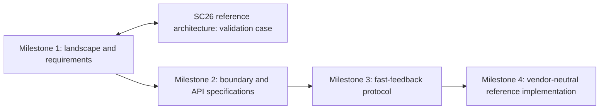

# Meeting 00 — Milestone 1 Overview and SC26 Plan

**Purpose:** Establish a shared understanding of Milestone 1, its relationship to the OpenQSE reference architecture, and the eight-week delivery plan leading to SC26.  
**Target release:** Landscape & Requirements v0.1 by November 13, 2026  
**Validation milestone:** SC26, November 15–20, 2026

## 1. Milestone 1 at a glance

### Milestone title

**Landscape and Requirements Report**

### Objective

> Characterize the functional roles, interfaces, information flows, timing regimes, and interoperability requirements that connect HPC resources and quantum execution/control systems for scalable hybrid HPC–QC operation.

Milestone 1 will identify what the ecosystem needs before the working group attempts to define a standard. It will survey current approaches, describe representative integration scenarios, establish a vendor-independent functional model, collect initial requirements, and identify the boundaries where OpenQSE can provide the most value.

### The question Milestone 1 answers

> **What interfaces and requirements are necessary for scalable, interoperable HPC–QC integration, and where do existing approaches leave genuine gaps?**

### What Milestone 1 is not

Milestone 1 is not:

- a final normative specification;
- a selection of preferred vendors or products;
- an endorsement of one software stack or architecture;
- a complete performance benchmark of participating systems; or
- an attempt to assign precise numerical requirements without supporting evidence.

Those distinctions are important because Milestone 1 provides the evidence and prioritization needed for later specification and implementation work.

## 2. Milestone 1 outputs

The SC26-ready v0.1 package should contain the following deliverables.

| Deliverable | Purpose | SC26 target |
|---|---|---|
| Landscape & Requirements white paper v0.1 | Integrates scope, use cases, architecture, requirements, gaps, and recommendations | Reviewable 15–25 page release |
| Use-case set | Establishes the scenarios that drive requirements | Five to seven use-case cards |
| Functional architecture | Defines logical roles without assuming particular products | One approved vendor-independent diagram and role definitions |
| Interface taxonomy | Names and describes candidate interoperability boundaries | Interface register with stable provisional IDs |
| Technology landscape | Maps existing projects, standards, APIs, and vendor approaches to logical roles and interfaces | Evidence-linked landscape table |
| Requirements matrix | Records qualitative and quantitative needs by use case and interface | Initial matrix with evidence and confidence status |
| Gap analysis | Separates missing interoperability mechanisms from implementation preferences | Prioritized gaps and recommendations |
| SC26 implementation mapping | Shows which logical roles and interfaces the current reference architecture exercises | Covered/partial/not-covered map |
| Open-question backlog | Preserves unresolved items without blocking v0.1 | Owned issues for v1.0 or later milestones |

## 3. Connection to the OpenQSE reference architecture

### Governing principle

> **The OpenQSE reference architecture is a concrete implementation and validation vehicle for Milestone 1. It does not define or limit the scope of the landscape and requirements analysis.**

The current reference architecture is influenced by the organizations and technologies participating in the SC26 effort. That is useful because it provides a real system against which assumptions can be tested. It also means the working group must distinguish between:

- a **logical role or required behavior** that should be considered broadly; and
- a **particular implementation choice** made for the SC26 pathfinder.

For example, a functional architecture may identify a workflow runtime, HPC resource manager, quantum resource manager, quantum runtime, and control system. The SC26 implementation may instantiate some of those roles using named projects. Milestone 1 should describe the roles and required behaviors first, then map named technologies onto them.

### Two-way relationship

| Milestone 1 contributes to the reference architecture | The reference architecture contributes to Milestone 1 |
|---|---|
| Vendor-independent roles and terminology | A concrete end-to-end integration case |
| Use cases and expected system behaviors | Evidence about what can be implemented now |
| Interface taxonomy | Real boundaries, adapters, and operational dependencies |
| Initial requirements and open questions | Measurements, constraints, and failure modes |
| Gaps requiring later standardization | Feedback showing missing or unnecessary abstractions |
| A basis for comparing future implementations | A demonstrable subset for SC26 discussion |

### How SC26 coverage will be represented

Each interface in the Milestone 1 taxonomy should be classified as:

1. **Demonstrated at SC26** — the implementation exercises the interface end to end.
2. **Partially exercised at SC26** — some functions or requirements are represented.
3. **Architecturally represented but not exercised** — the role exists, but the demonstration does not validate the interface.
4. **Outside the SC26 implementation** — the interface remains part of the broader landscape but is not present in this pathfinder.

The fourth category is a valid finding, not a failure of the SC26 architecture.

### Sequencing

The SC26 pathfinder is therefore a precursor to Milestone 4, not necessarily the final reference implementation of specifications that have not yet been written.

## 4. Eight-week delivery plan

### Critical path

> **Scope → use cases → functional architecture → interface taxonomy → requirements → gap analysis → v0.1 release**

The SC26 implementation proceeds in parallel and intersects with this path during architecture review, requirements validation, and release preparation.

| Week | Dates | Focus | Work and decisions | Deliverables due |
|---:|---|---|---|---|
| 1 | Sep 22–29 | Scope and charter | Confirm objective, in/out-of-scope boundaries, tentative use cases, decision process, and workstream owners | Charter baseline; use-case shortlist; owner matrix; Meeting 1 decisions |
| 2 | Sep 30–Oct 6 | Use cases and logical roles | Complete use-case cards; refine actors, data/control flows, timing regimes, and logical role definitions | Draft use-case cards; functional architecture v0.1; terminology list |
| 3 | Oct 7–13 | Interfaces and landscape | Identify candidate interfaces; map existing projects, standards, protocols, APIs, and products without treating examples as the architecture | Provisional interface register; technology landscape v0.1; Meeting 2 decisions |
| 4 | Oct 14–20 | Requirements collection | Populate requirements by use case and interface; distinguish required, target, observed, and TBD values | Requirements entries; evidence register; unresolved measurement tasks |
| 5 | Oct 21–27 | Requirements and gaps | Reconcile conflicting inputs; identify adequate existing solutions, genuine gaps, and areas requiring benchmarking | Requirements baseline; prioritized gap list; Meeting 3 decisions |
| 6 | Oct 28–Nov 3 | Draft integration | Integrate sections, figures, matrices, and recommendations; map SC26 components onto logical roles and interfaces | Full white-paper draft v0.1; SC26 coverage map; initial recommendations |
| 7 | Nov 4–10 | Technical and release review | Resolve technical comments, unsupported claims, terminology conflicts, and major omissions; move non-blocking questions to backlog | Release candidate; review disposition log; Meeting 4 approval |
| 8 | Nov 11–17 | Release and SC26 transition | Complete editorial pass; freeze release before travel; prepare presentation material and feedback capture | `v0.1.0-sc26` by Nov 13; architecture graphic; summary material; SC26 feedback form/backlog |

## 5. Decision gates

### Gate 1 — Scope baseline

**Target:** September 29

- Scope and exclusions are explicit.
- Use-case classes are selected.
- Workstream leads and reviewers are assigned.
- The reference architecture is confirmed as a validation case rather than a scope constraint.

### Gate 2 — Architecture and landscape baseline

**Target:** October 13

- Logical roles and interface IDs are provisionally stable.
- Technologies are mapped as examples.
- Missing ecosystem perspectives have owners.
- Initial SC26 coverage is visible.

### Gate 3 — Requirements and gap baseline

**Target:** October 27

- Requirements are traceable to use cases and evidence.
- Required, target, observed, and TBD values are distinguished.
- Priority interoperability gaps are identified.
- Candidate work for Milestones 2 and 3 is documented.

### Gate 4 — SC26 release approval

**Target:** November 10

- Headline findings are supported.
- Major technical comments have dispositions.
- Open questions are clearly labeled and assigned.
- The steering group approves publication of v0.1.

## 6. Biweekly meeting cadence

| Meeting | Date | Decision focus | Primary output |
|---|---|---|---|
| Meeting 00 | Sep 22 | Milestone orientation and delivery plan | Shared project model and eight-week plan |
| Meeting 01 | Sep 29 | Scope, use cases, architecture straw man, initial interfaces | Scope baseline and assignments |
| Meeting 02 | Oct 13 | Functional architecture, interface taxonomy, technology landscape | Architecture and landscape baseline |
| Meeting 03 | Oct 27 | Requirements, evidence, and gap analysis | Requirements and gap baseline |
| Meeting 04 | Nov 10 | Release-candidate review | Approval to freeze v0.1 |
| Post-SC26 review | Late Nov / early Dec | Feedback triage and v1.0 planning | Revision backlog and Milestone 2 handoff |

## 7. Workstreams

Milestone 1 is organized into five coordinated workstreams.

| Workstream | Responsibility | Key outputs |
|---|---|---|
| Scope and use cases | Define the problem space and representative scenarios | Charter and use-case cards |
| Architecture and interfaces | Define logical roles and candidate interoperability boundaries | Functional architecture and interface register |
| Technology landscape | Survey implementations, standards, APIs, and protocols | Landscape table and evidence |
| Requirements and gaps | Derive needs from use cases and identify missing capabilities | Requirements matrix and gap analysis |
| White paper and SC26 integration | Integrate outputs and map the pathfinder implementation | v0.1 release and SC26 coverage map |

## 8. Project-management rules

### Meetings are decision gates

Research, drafting, and detailed review happen asynchronously. Biweekly meetings are reserved for:

- cross-cutting decisions;
- disputed classifications or terminology;
- evidence conflicts;
- risk and dependency escalation; and
- confirmation of owners and deadlines.

### Every action is explicit

Each meeting ends with:

> **Decision or question → owner → deliverable → deadline → status**

### Evidence before precision

Do not manufacture a numerical requirement to complete a matrix. When evidence is insufficient, record:

> **TBD — evidence or benchmark required**

and create an owned follow-up task.

### Protect the SC26 date

After the November 10 release review, newly discovered non-blocking work moves to the v1.0 backlog. Only an issue that invalidates a headline conclusion should prevent the November 13 freeze.

## 9. Definition of success at SC26

Milestone 1 v0.1 is successful if the working group can clearly explain:

1. which integration scenarios were considered;
2. which logical roles and interfaces those scenarios require;
3. what requirements are supported by current evidence;
4. which gaps are genuine candidates for OpenQSE action;
5. what subset the SC26 implementation demonstrates; and
6. what work should advance into Milestones 2 and 3.

The goal is not to claim that the architecture is finished. The goal is to give the broader community a coherent, evidence-based structure to review, challenge, and extend.
